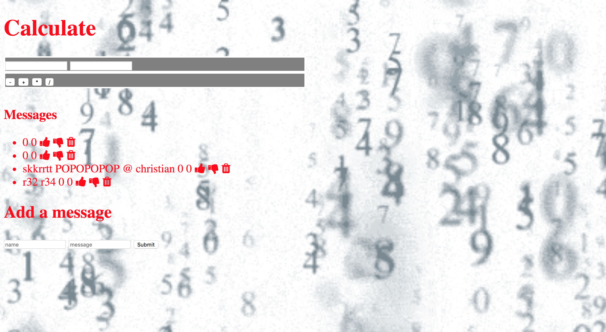

<!-- 

## Installation

1. Clone repo
2. run `npm install`

## Usage

1. run `npm run savage`
2. Navigate to `localhost:3000`
Simple-Express -->
# Simple Express Project
A project that allows the user to post a comment, read each previous comment, rate each comment with thumbs up or down and delete any comment inside the app. It also allows the user to use a basic calculator for math problems.

**Link to project:** localhost:8000

<!--  -->

## How It's Made:

**Tech used:** HTML, CSS, JavaScript, express and node.js

I used a previous project and intergrated my javascript with the current javascript file. I then added my html file to the index.ej file so the calculator could still work. Then i went to the public folder and under the styles.css i changed how the calculator looked, and the background GIF.   

<!-- ## Optimizations
*(optional)*

You don't have to include this section but interviewers *love* that you can not only deliver a final product that looks great but also functions efficiently. Did you write something then refactor it later and the result was 5x faster than the original implementation? Did you cache your assets? Things that you write in this section are **GREAT** to bring up in interviews and you can use this section as reference when studying for technical interviews! -->

### Lessons Learned:

I learned not to rush my work when on thing is not working. I also learned that a simple express can be modified easily as long as you know which folder to access to make the changes you want to make. 
<!-- No matter what your experience level, being an engineer means continuously learning. Every time you build something you always have those *whoa this is awesome* or *fuck yeah I did it!* moments. This is where you should share those moments! Recruiters and interviewers love to see that you're self-aware and passionate about growing. -->

<!-- ## Examples:
Take a look at these couple examples that I have in my own portfolio:

**Palettable:** https://github.com/alecortega/palettable

**Twitter Battle:** https://github.com/alecortega/twitter-battle

**Patch Panel:** https://github.com/alecortega/patch-panel -->
<!-- GitHub
alecortega/palettable
palettable - Create color palettes using the knowledge of millions of designers.
GitHub
alecortega/twitter-battle
twitter-battle - Compare how two search terms compete against each other in real-time.
GitHub
alecortega/patch-panel
patch-panel - Makes responsive grid + panel layouts possible. -->
